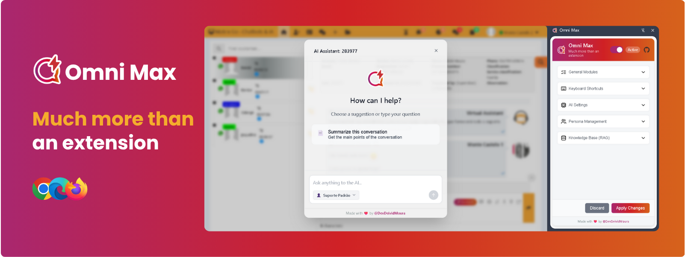

<a name="readme-top"></a>

<div align="center">


<br>

# Welcome to the Omni Max repository

English · [Português](docs/README.pt-BR.md) · [Español](docs/README.es.md) 

**Hey there, agent! Ever wished you had a superpower to handle the daily grind of customer service?** <br/>
We know how challenging the job can be. That's why we created **Omni Max**: the AI extension that every customer service professional deserves. <br/>
With conversation summaries, response assistance, magic templates, and life-saving shortcuts, your experience is about to change. <br/>
**Your only frustration will be not having discovered this sooner**. 😉


[![][chrome-users-shield]][chrome-users-link]
[![][latest-version-shield]][latest-version-link]
[![][github-license-shield]][github-license-link]<br/>


</br>

</div>

## ❤️ About the Project

> [!IMPORTANT]
> Omni Max was born from a real need: **customer service work doesn't have to be so exhausting.** If you agree, star this repository to give us a boost! ⭐️

Omni Max is your new secret weapon for the ASC SAC platform (and its white-label variations). A supercharged friend with Artificial Intelligence, designed to automate the boring and repetitive tasks.

Our goal is simple: reduce stress, optimize your time, and allow you to focus on what really matters: delivering exceptional, human-centered service.


## 📌 Get Omni Max

Omni Max is currently available for Google Chrome, Microsoft Edge, and Mozilla Firefox.

Get it now at:

<p align="center">
    <a href="#">
    
    </a>
    <a href="#">
    
    </a>
    <a href="#">
    
    </a>
</p>

## ✨ What Does Omni Max Actually Do?

Omni Max has evolved! In addition to the classic features, you now have a true AI ecosystem at your disposal:

* 🤖 **AI with Full Context for Real Help:** The assistant arrives knowing everything! It reads the entire conversation with the customer and uses LangChain and LangGraph to give you relevant help, without you wasting time explaining the obvious.

* 🧠 **Your Private Response Library:** Upload manuals, procedures, or any document (.md, .txt). The AI consults this base to provide accurate answers based on *your* data. It's like having your company's expert available 24/7.

* 🎭 **The AI Actor:** Want the AI to sound like a "Billing Expert" or a "Friendly Tier 1 Support"? You create the "Personas," define the tone of voice, the rules, and even which tools it can use. You're the director!

* 🛠️ **Tools Up Its Sleeve:** The AI doesn't pull answers out of thin air, it searches for them! With access to tools like your knowledge base, the information is always fact-based.

* 🔗 **You Choose the Magic:** Prefer **OpenAI**? A fan of **Google Gemini**? Or want to use a model running on your own PC with **Ollama**? You're in charge here. Connect your favorite AI provider.

**And for the day-to-day?**

* 📝 **Magic Templates:** Answer frequent questions with a click. Insert names and variables automatically, quickly, and without errors.

* 🖱️ **Life-Saving Shortcuts:** Copy name, ID, and other information with a simple keyboard shortcut. It's almost... magic.

* 🎨 **The Layout is Yours:** Does the conversation list on the right bother you? Move it to the left! Adjust the small details of the interface so everything is exactly where you like it.

* ⚙️ **You're in Command (Modular Design):** Omni Max adapts to you. Enable or disable each feature to create your perfect work experience.

## 🛠️ What's Under the Hood? (Main Technologies)

* **[LangChain](https://js.langchain.com/)** – A library to orchestrate calls to AI providers (OpenAI, Anthropic, Google GenAI, etc.), used in the Agent.

* **[LangGraph](https://langchain-ai.github.io/langgraphjs/)** – An extension of the LangChain library for building stateful agents, used to give the assistant the ability to remember context, use tools to fetch context, query the knowledge base, and more.

* **[IndexedDB](https://developer.mozilla.org/en-US/docs/Web/API/IndexedDB_API)**: Used for the knowledge base `VectorStore` and for saving the agent's conversation state (`Checkpointer`).

* **[Svelte](https://svelte.dev/)** (v5) – A lightweight reactive framework for building the UI.

* **[TypeScript](https://www.typescriptlang.org/)** – Static typing and autocompletion, ensuring more robust code.

* **[CRXJS Vite Plugin](https://github.com/crxjs/chrome-extension-tools/blob/main/packages/vite-plugin/README.md)** – A plugin that integrates Manifest V3 into the Vite workflow, necessary for modern Chrome extensions.

* **[Vitest](https://vitest.dev/) + [Vitest-Chrome](https://github.com/antonyg/sample-vitest-chrome)** – Unit and integration testing suite specific to extension environments.

* **[Github Actions](https://github.com/features/actions)** – CI/CD for checking (svelte-check), testing, building, and automatically deploying to the Chrome Web Store.

## 🎯 Target Platform

This extension is designed to integrate with and enhance the user experience on the ASC SAC omnichannel customer service platform, and can also be adapted for the white-label variations from ASC Brasil.

## 🚀 Getting Started

### Prerequisites

* [Node.js](https://nodejs.org/) (LTS version recommended)
* `npm` (comes with Node.js) or `yarn` / `pnpm`

### Installation (for Users)

For detailed usage instructions, please refer to our **[User Guide](/docs/USER_GUIDE.md)**.

### Development Setup

To set up Omni Max for development:

1.  **Clone the repository:**
    ```bash
    git clone [https://github.com/DevDeividMoura/omni-max.git](https://github.com/DevDeividMoura/omni-max.git)
    cd omni-max
    ```

2.  **Install dependencies:**
    ```bash
    npm install
    # or yarn install / pnpm install
    ```

3.  **Run in development mode:**
    ```bash
    npm run dev
    ```

4.  **Load the unpacked extension in Chrome:**
    * Open Chrome and navigate to `chrome://extensions`.
    * Enable "Developer mode" using the toggle switch.
    * Click the "Load unpacked" button.
    * Select the `dist` directory from your project folder.

Omni Max should now be installed and active for development.

## 🔧 Configuration

Omni Max is highly configurable through its side panel. You can:

* Enable or disable the extension globally.
* Activate or deactivate each module individually.
* Choose your AI provider (**OpenAI, Gemini, Ollama**) and manage your credentials (API keys or URLs).
* Select specific Chat and Embedding models.
* Create and manage AI **Personas**.
* Add and remove documents from your **Knowledge Base**.
* Customize keyboard shortcuts.

## 🏗️ Building for Production

To create a production-ready build of the extension (e.g., for packing and submitting to the Chrome Web Store):

```bash
npm run build
```

This will generate optimized files in the `/dist` directory.

## 🤝 Want to Be a Part of This?

Awesome! Omni Max is an open-source project and we would love to have your help.

To contribute, please read our **[Contribution Guide](/CONTRIBUTING.md)**. It has everything you need to know about our workflow, code standards, and how to submit your pull requests.

## 📝 License

This project is licensed under the **MIT License**. See the [LICENSE](LICENSE) file for more details.

---

Made with ❤️ by [@DevDeividMoura](https://github.com/DevDeividMoura)


<div align="right">

[![][back-to-top]](#readme-top)

</div>

[back-to-top]: https://img.shields.io/badge/-BACK_TO_TOP-151515?style=flat-square

[chrome-users-shield]: https://img.shields.io/chrome-web-store/users/lddmoiehfgdcmkgkfocnlddlolhehmnh?style=flat-square&logo=googlechrome&logoColor=white&label=chrome%20active%20users&labelColor=black&color=9E15D9
[chrome-users-link]: #
[latest-version-shield]: https://img.shields.io/chrome-web-store/v/lddmoiehfgdcmkgkfocnlddlolhehmnh?style=flat-square&label=latest%20version&labelColor=black&color=0FC54F
[latest-version-link]: #
[github-license-shield]: https://img.shields.io/github/license/DevDeividMoura/omni-max?style=flat-square&logo=github&labelColor=black&color=508CF9
[github-license-link]: https://github.com/DevDeividMoura/omni-max/issues