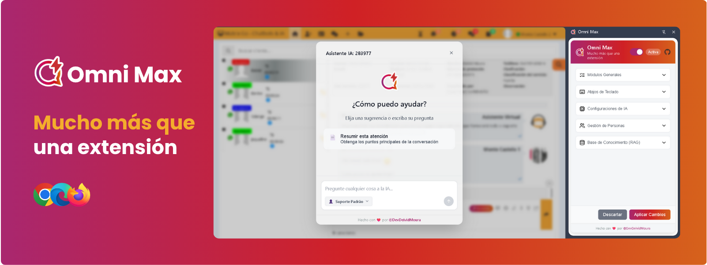
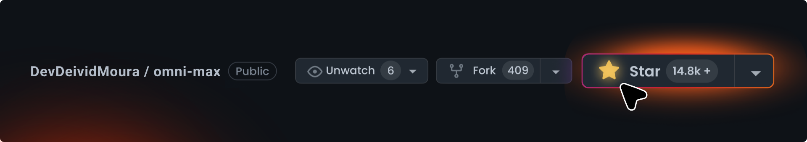

<a name="readme-top"></a>

<div align="center">


<br>

# Bienvenido al repositorio de Omni Max

[English](../README.md) · [Português](README.pt-BR.md) · Español

**¡Hola, agente! ¿Alguna vez has deseado tener un superpoder para lidiar con la rutina de atención al cliente?** <br/>
Sabemos lo desafiante que puede ser el trabajo. Por eso, creamos **Omni Max**: la extensión de IA que todo profesional de atención al cliente merece. <br/>
Con resúmenes de conversaciones, ayuda en las respuestas, plantillas mágicas y atajos que salvan vidas, tu experiencia está a punto de cambiar. <br/>
**Tu única frustración será no haber descubierto esto antes**. 😉


[![][chrome-users-shield]][chrome-users-link]
[![][latest-version-shield]][latest-version-link]
[![][github-license-shield]][github-license-link]<br/>


</br>

</div>

## ❤️ Sobre el Proyecto

> [!IMPORTANT]
> Omni Max nació de una necesidad real: **el trabajo de atención al cliente no tiene por qué ser tan agotador.** Si estás de acuerdo, ¡dale una estrella a este repositorio para apoyarnos! ⭐️

Omni Max es tu nueva arma secreta para la plataforma ASC SAC (y sus variaciones de marca blanca). Una amiga potenciada con Inteligencia Artificial, diseñada para automatizar las tareas aburridas y repetitivas.

Nuestro objetivo es simple: reducir el estrés, optimizar tu tiempo y permitirte centrarte en lo que realmente importa: ofrecer una atención humana y excepcional.



## 📌 Obtén Omni Max

Omni Max está actualmente disponible para Google Chrome, Microsoft Edge y Mozilla Firefox.

Consíguelo ahora en:

<p align="center">
    <a href="#">
    
    </a>
    <a href="#">
    
    </a>
    <a href="#">
    
    </a>
</p>

## ✨ ¿Qué Hace Omni Max, Después de Todo?

¡Omni Max ha evolucionado! Además de las funcionalidades clásicas, ahora tienes un verdadero ecosistema de IA a tu disposición:

* 🤖 **IA con Contexto Total para Ayuda de Verdad:** ¡El asistente ya llega sabiéndolo todo! Lee la conversación completa con el cliente y utiliza LangChain y LangGraph para darte ayuda relevante, sin que pierdas tiempo explicando lo obvio.

* 🧠 **Tu Biblioteca Particular de Respuestas:** Sube manuales, procedimientos o cualquier documento (.md, .txt). La IA consulta esta base para dar respuestas precisas y basadas en *tus* datos. Es como tener a un experto de tu empresa disponible 24/7.

* 🎭 **El Actor de IA:** ¿Quieres que la IA suene como un "Experto en Facturas" o como el "Soporte Amigable Nivel 1"? Tú creas las "Personas", defines el tono de voz, las reglas e incluso qué herramientas puede usar. ¡Tú eres el director!

* 🛠️ **Herramientas Bajo la Manga:** La IA no saca las respuestas de la nada, ¡las busca! Con acceso a herramientas como tu base de conocimientos, la información siempre se basa en hechos.

* 🔗 **Tú Eliges la Magia:** ¿Prefieres **OpenAI**? ¿Eres fan de **Google Gemini**? ¿O quieres usar un modelo que se ejecuta en tu propio PC con **Ollama**? Aquí mandas tú. Conecta tu proveedor de IA favorito.

**¿Y para el día a día?**

* 📝 **Plantillas Mágicas:** Responde preguntas frecuentes con un solo clic. Inserta nombres y variables de forma automática, rápida y sin errores.

* 🖱️ **Atajos que Salvan Vidas:** Copia el nombre, DNI/CIF y otra información con un simple atajo de teclado. Es casi... mágico.

* 🎨 **El Diseño es Tuyo:** ¿Te molesta la lista de conversaciones a la derecha? ¡Muévela a la izquierda! Ajusta los pequeños detalles de la interfaz para que todo quede exactamente donde te gusta.

* ⚙️ **Tú al Mando (Diseño Modular):** Omni Max se adapta a ti. Habilita o deshabilita cada funcionalidad para crear tu experiencia de trabajo perfecta.

## 🛠️ ¿Qué Hay Debajo del Capó? (Tecnologías Principales)

* **[LangChain](https://js.langchain.com/)** – biblioteca para orquestar llamadas a proveedores de IA (OpenAI, Anthropic, Google GenAI, etc.), utilizada en el Agente.

* **[LangGraph](https://langchain-ai.github.io/langgraphjs/)** – extensión de la biblioteca LangChain para la construcción de agentes con memoria (stateful), utilizada para dar al asistente la capacidad de recordar el contexto, usar herramientas para buscar contexto, consultar la base de conocimientos y mucho más.

* **[IndexedDB](https://developer.mozilla.org/en-US/docs/Web/API/IndexedDB_API)**: Usado para el `VectorStore` de la base de conocimientos y para guardar el estado de las conversaciones del agente (`Checkpointer`).

* **[Svelte](https://svelte.dev/)** (v5) – framework reactivo y ligero para la construcción de la UI.

* **[TypeScript](https://www.typescriptlang.org/)** – tipado estático y autocompletado, garantizando más seguridad en el código.

* **[CRXJS Vite Plugin](https://github.com/crxjs/chrome-extension-tools/blob/main/packages/vite-plugin/README.md)** – plugin que integra Manifest V3 al flujo de trabajo de Vite, necesario para las extensiones modernas de Chrome.

* **[Vitest](https://vitest.dev/) + [Vitest-Chrome](https://github.com/antonyg/sample-vitest-chrome)** – suite de pruebas unitarias y de integración específica para entornos de extensión.

* **[Github Actions](https://github.com/features/actions)** – CI/CD para verificación (svelte-check), pruebas, compilación y despliegue automático en la Chrome Web Store.

## 🎯 Plataforma Objetivo

Esta extensión está diseñada para integrarse y mejorar la experiencia del usuario en la plataforma de atención al cliente omnicanal ASC SAC, pudiendo también ser adaptada para las variaciones de marca blanca de ASC Brasil.

## 🚀 Cómo Empezar

### Prerrequisitos

* [Node.js](https://nodejs.org/) (versión LTS recomendada)
* `npm` (viene con Node.js) o `yarn` / `pnpm`

### Instalación (para Usuarios)

Para instrucciones detalladas de uso, por favor, consulta nuestra **[Guía del Usuario](/docs/GUIA_DEL_USUARIO.md)**.

### Configuración de Desarrollo

Para configurar Omni Max para desarrollo:

1.  **Clona el repositorio:**
    ```bash
    git clone [https://github.com/DevDeividMoura/omni-max.git](https://github.com/DevDeividMoura/omni-max.git)
    cd omni-max
    ```

2.  **Instala las dependencias:**
    ```bash
    npm install
    # o yarn install / pnpm install
    ```

3.  **Ejecuta en modo de desarrollo:**
    ```bash
    npm run dev
    ```

4.  **Carga la extensión descomprimida en Chrome:**
    * Abre Chrome y navega a `chrome://extensions`.
    * Habilita el "Modo de desarrollador" con el interruptor.
    * Haz clic en el botón "Cargar descomprimida".
    * Selecciona el directorio `dist` de la carpeta de tu proyecto.

Omni Max ahora debería estar instalado y activo para el desarrollo.

## 🔧 Configuración

Omni Max es altamente configurable a través de su panel lateral. Puedes:

* Habilitar o deshabilitar la extensión globalmente.
* Activar o desactivar cada módulo individualmente.
* Elegir tu proveedor de IA (**OpenAI, Gemini, Ollama**) y gestionar tus credenciales (claves de API o URLs).
* Seleccionar modelos específicos de Chat y de Embedding.
* Crear y gestionar **Personas** de IA.
* Añadir y eliminar documentos de tu **Base de Conocimientos**.
* Personalizar los atajos de teclado.

## 🏗️ Compilando para Producción

Para crear una compilación de la extensión lista para producción (ej: para empaquetar y enviar a la Chrome Web Store):

```bash
npm run build
```

Esto generará archivos optimizados en el directorio `/dist`.

## 🤝 ¿Quieres Formar Parte de Esto?

¡Genial! Omni Max es un proyecto de código abierto y nos encantaría contar con tu ayuda.

Para contribuir, por favor, lee nuestra **[Guía de Contribución](/CONTRIBUTING.md)**. Tiene todo lo que necesitas saber sobre nuestro flujo de trabajo, estándares de código y cómo enviar tus pull requests.

## 📝 Licencia

Este proyecto está licenciado bajo la **Licencia MIT**. Consulta el archivo [LICENSE](LICENSE) para más detalles.

---

Hecho con ❤️ por [@DevDeividMoura](https://github.com/DevDeividMoura)


<div align="right">

[![][back-to-top]](#readme-top)

</div>

[back-to-top]: https://img.shields.io/badge/-VOLVER_ARRIBA-151515?style=flat-square

[chrome-users-shield]: https://img.shields.io/chrome-web-store/users/lddmoiehfgdcmkgkfocnlddlolhehmnh?style=flat-square&logo=googlechrome&logoColor=white&label=chrome%20active%20users&labelColor=black&color=9E15D9
[chrome-users-link]: #
[latest-version-shield]: https://img.shields.io/chrome-web-store/v/lddmoiehfgdcmkgkfocnlddlolhehmnh?style=flat-square&label=latest%20version&labelColor=black&color=0FC54F
[latest-version-link]: #
[github-license-shield]: https://img.shields.io/github/license/DevDeividMoura/omni-max?style=flat-square&logo=github&labelColor=black&color=508CF9
[github-license-link]: https://github.com/DevDeividMoura/omni-max/issues