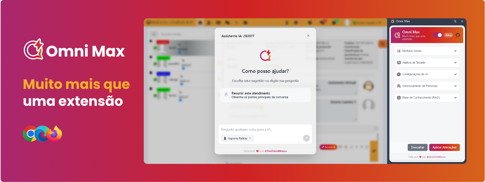

<a name="readme-top"></a>

<div align="center">


<br>

# Boas-vindas ao repositório da Omni Max

[English](../README.md) · Português · [Español](README.es.md) 

---

**E aí, agente! Já desejou ter um superpoder para lidar com a rotina do atendimento ao cliente?** <br/>
Nós sabemos como o trabalho pode ser desafiador. Por isso, criamos a **Omni Max**: a extensão de IA que todo profissional de atendimento merece. <br/>
Com resumos de conversas, ajuda nas respostas, templates mágicos e atalhos que salvam vidas, sua experiência está prestes a mudar. <br/>
**Sua única frustração será não ter descoberto isso antes**. 😉


<!-- SHIELD GROUP -->

[![][chrome-users-shield]][chrome-users-link]
[![][latest-version-shield]][latest-version-link]
[![][github-license-shield]][github-license-link]<br/>


</br>

</div>

## ❤️ Sobre o Projeto

> [!IMPORTANT]
> A Omni Max nasceu de uma necessidade real: **o trabalho de atendimento não precisa ser tão desgastante.** Se você concorda, marque este repositório com uma estrela para nos dar aquela força! ⭐️

A Omni Max é sua nova arma secreta para a plataforma ASC SAC (e suas variações white-label). Uma amiga turbinada com Inteligência Artificial, projetada para automatizar as tarefas chatas e repetitivas.

Nosso objetivo é simples: reduzir o estresse, otimizar seu tempo e permitir que você foque no que realmente importa: entregar um atendimento humano e excepcional.


## 📌 Obtenha a Omni Max

A Omni Max está atualmente disponível para Google Chrome, Microsoft Edge e Mozilla Firefox.

Adquira agora em:

<p align="center">
    <a href="#">
    
    </a>
    <a href="#">
    
    </a>
    <a href="#">
    
    </a>
</p>

## ✨ O Que a Omni Max Faz, Afinal?

A Omni Max evoluiu! Além das funcionalidades clássicas, agora você tem um verdadeiro ecossistema de IA à sua disposição:

* 🤖 IA com Contexto Total para Ajuda de Verdade: O assistente já chega sabendo de tudo! Ele lê a conversa completa com o cliente e usa LangChain e LangGraph para te dar ajuda relevante, sem que você perca tempo explicando o óbvio.

* 🧠 **Sua Biblioteca Particular de Respostas:** Faça o upload de manuais, procedimentos ou qualquer documento (.md, .txt). A IA consulta essa base para dar respostas precisas e baseadas nos *seus* dados. É como ter um especialista da sua empresa disponível 24/7.

* 🎭 **O Ator de IA:** Quer que a IA soe como um "Expert em Faturas" ou como o "Suporte Amigável Nível 1"? Você cria as "Personas", define o tom de voz, as regras e até quais ferramentas ela pode usar. Você é o diretor!

* 🛠️ **Ferramentas na Manga:** A IA não tira as respostas da cartola, ela busca! Com acesso a ferramentas como sua base de conhecimento, as informações são sempre baseadas em fatos.

* 🔗 **Você Escolhe a Magia:** Prefere **OpenAI**? É fã do **Google Gemini**? Ou quer usar um modelo rodando no seu próprio PC com **Ollama**? Aqui quem manda é você. Conecte seu provedor de IA favorito.

**E para o dia a dia?**

* 📝 **Templates Mágicos:** Responda perguntas frequentes com um clique. Insira nomes e variáveis de forma automática, rápida e sem erros.

* 🖱️ **Atalhos que Salvam Vidas:** Copie nome, CPF/CNPJ e outras informações com um simples atalho de teclado. É quase... mágica.

* 🎨 **O Layout é Seu:** A lista de conversas te incomoda na direita? Mova para a esquerda! Ajuste os pequenos detalhes da interface para que tudo fique exatamente onde você gosta.

* ⚙️ **Você no Comando (Design Modular):** A Omni Max se adapta a você. Habilite ou desabilite cada funcionalidade para criar sua experiência de trabalho perfeita.

## 🛠️ O Que Tem Por Baixo do Capô? (Principais Tecnologias)

* **[LangChain](https://js.langchain.com/)** – biblioteca para orquestrar chamadas a provedores de IA (OpenAI, Anthropic, Google GenAI, etc.), utilizada no Agente.

* **[LangGraph](https://langchain-ai.github.io/langgraphjs/)** – extensão da biblioteca LangChain para a construção de agentes com memória (stateful), utilizada para dar ao assistente a capacidade de lembrar o contexto, usar ferramentas para buscar o contexto, consultar a base de conhecimento e muito mais.

* **[IndexedDB](https://developer.mozilla.org/en-US/docs/Web/API/IndexedDB_API)**: Usado para o `VectorStore` da base de conhecimento e para salvar o estado das conversas do agente (`Checkpointer`).

* **[Svelte](https://svelte.dev/)** (v5) – framework reativo leve para construção da UI.

* **[TypeScript](https://www.typescriptlang.org/)** – tipagem estática e autocompletar, garantindo mais segurança no código.

* **[CRXJS Vite Plugin](https://github.com/crxjs/chrome-extension-tools/blob/main/packages/vite-plugin/README.md)** – plugin que integra Manifest V3 ao fluxo do Vite, necessário para extensões Chrome modernas.

* **[Vitest](https://vitest.dev/) + [Vitest-Chrome](https://github.com/antonyg/sample-vitest-chrome)** – suite de testes unitários e integração específica para ambientes de extensão.

* **[Github Actions](https://github.com/features/actions)** – CI/CD para checagem (svelte-check), testes, build e deploy automático na Chrome Web Store.

## 🎯 Plataforma Alvo

Esta extensão é projetada para se integrar e aprimorar a experiência do usuário na plataforma de atendimento ao cliente omnichannel ASC SAC, podendo também ser adaptada para as varições white-label da ASC Brasil.

## 🚀 Como Começar

### Instalação (para Usuários)

Para instruções detalhadas de uso, por favor, consulte nosso **[Guia do Usuário](./user_guides/USER-GUIDE.pt-BR.md)**.

### Pré-requisitos

* [Node.js](https://nodejs.org/) (versão LTS recomendada)
* `npm` (vem com o Node.js) ou `yarn` / `pnpm`

### Configuração de Desenvolvimento

Para configurar a Omni Max para desenvolvimento:

1.  **Clone o repositório:**
    ````bash
    git clone https://github.com/DevDeividMoura/omni-max.git
    cd omni-max
    ````

2.  **Instale as dependências:**
    ````bash
    npm install
    # ou yarn install / pnpm install
    ````

3.  **Execute em modo de desenvolvimento:**
    ````bash
    npm run build
    ````

4.  **Carregue a extensão descompactada no Chrome:**
    * Abra o Chrome e navegue para `chrome://extensions`.
    * Habilite o "Modo do desenvolvedor" usando o interruptor.
    * Clique no botão "Carregar sem compactação".
    * Selecione o diretório `dist` da pasta do seu projeto.

A Omni Max deve agora estar instalado e ativo para desenvolvimento.

## 🔧 Configuração

O Omni Max é altamente configurável através do seu painel lateral. Você pode:

* Habilitar ou desabilitar a extensão globalmente.
* Ativar ou desativar cada módulo individualmente.
* Escolher seu provedor de IA (**OpenAI, Gemini, Ollama**) e gerenciar suas credenciais (chaves de API ou URLs).
* Selecionar modelos de Chat e de Embedding específicos.
* Criar e gerenciar **Personas** de IA.
* Adicionar e remover documentos da sua **Base de Conhecimento**.
* Personalizar os atalhos de teclado.

## 🏗️ Compilando para Produção

Para criar uma compilação da extensão pronta para produção (ex: para empacotar e enviar para a Chrome Web Store):

````bash
npm run build
````

Isso gerará arquivos otimizados no diretório `/dist`.

## 🤝 Quer Fazer Parte Disso?

Incrível! O Omni Max é um projeto de código aberto e adoraríamos ter sua ajuda.

Para contribuir, por favor, leia nosso **[Guia de Contribuição](/CONTRIBUTING.md)**. Ele tem tudo que você precisa saber sobre nosso fluxo de trabalho, padrões de código e como enviar suas pull requests.

## 📝 Licença

Este projeto é licenciado sob a **Licença MIT**. Veja o arquivo [LICENSE](LICENSE) para mais detalhes.

---

Feito com ❤️ por [@DevDeividMoura](https://github.com/DevDeividMoura)


<div align="right">

[![][back-to-top]](#readme-top)

</div>

<!-- LINK GROUP -->

[back-to-top]: https://img.shields.io/badge/-BACK_TO_TOP-151515?style=flat-square

<!-- SHIELDS GROUP -->

[chrome-users-shield]: https://img.shields.io/chrome-web-store/users/lddmoiehfgdcmkgkfocnlddlolhehmnh?style=flat-square&logo=googlechrome&logoColor=white&label=chrome%20active%20users&labelColor=black&color=9E15D9
[chrome-users-link]: #
[latest-version-shield]: https://img.shields.io/chrome-web-store/v/lddmoiehfgdcmkgkfocnlddlolhehmnh?style=flat-square&label=latest%20version&labelColor=black&color=0FC54F
[latest-version-link]: #
[github-license-shield]: https://img.shields.io/github/license/DevDeividMoura/omni-max?style=flat-square&logo=github&labelColor=black&color=508CF9
[github-license-link]: https://github.com/DevDeividMoura/omni-max/issues