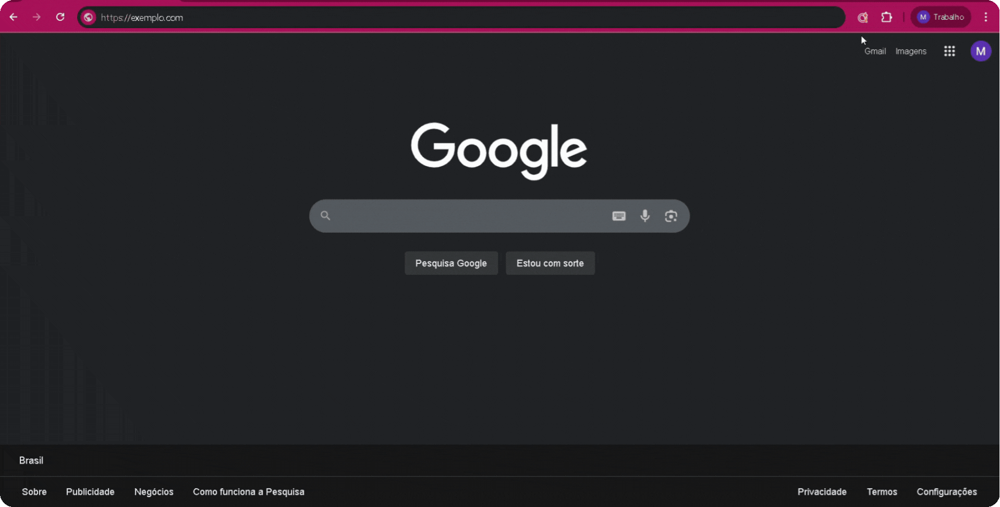

# Omni Max - Guía del Superagente 🦸

[English](./USER_GUIDE.md) · [Português](./USER_GUIDE.pt-BR.md) · Español

---

¡Hola, agente! Te damos la bienvenida a tu centro de entrenamiento. Esta guía es el mapa para dominar todos los superpoderes que **Omni Max** te ofrece.

Tu misión, si decides aceptarla, es transformar tu rutina de atención al cliente, automatizar las tareas tediosas y centrarte en lo que mejor sabes hacer: ser increíble con la gente.

¡Despeguemos! 🚀 

## Índice

1.  [Instalación: Poniéndose el Traje](#1-instalación-poniéndose-el-traje)
2.  [Configuración Inicial: Encendiendo los Motores](#2-configuración-inicial-encendiendo-los-motores)
3.  [Dominando tu Arsenal: Funcionalidades](#3-dominando-tu-arsenal-funcionalidades)
    * [El Asistente de IA: Tu Copiloto Inteligente](#el-asistente-de-ia-tu-copiloto-inteligente)
    * [Potenciando la IA: Personas y Base de Conocimiento](#potenciando-la-ia-personas-y-base-de-conocimiento)
    * [Herramientas del Día a Día: Agilidad Máxima](#herramientas-del-día-a-día-agilidad-máxima)
4.  [Solución de Problemas: Pequeños Ajustes en la Ruta](#4-solución-de-problemas-pequeños-ajustes-en-la-ruta)

-----

### 1. Instalación: Poniéndose el Traje

Para empezar tu viaje, primero necesitas tu traje. Omni Max está disponible en las principales tiendas de extensiones.

1.  Accede a la tienda de tu navegador:
    * [**Google Chrome**][chrome-web-store-link]
    2.  Haz clic en **"Añadir a Chrome"** u **"Obtener"**.
3.  Confirma la instalación. El icono de Omni Max () aparecerá en tu barra de herramientas.

**Consejo Pro**: Si está oculto en el menú de extensiones (el icono del rompecabezas З), haz clic ahí, busca Omni Max () en la lista y haz clic en la chincheta () para fijarlo a la barra. ¡Así siempre estará a un clic de distancia!

### 2. Configuración Inicial: Encendiendo los Motores

Con el traje puesto, es hora de sincronizarse con tu base de operaciones. Esta configuración inicial es crucial y toma menos de 30 segundos.

#### **Paso 1: Conecta Omni Max a tu Plataforma**

1.  Navega a la página del Panel del Agente de tu plataforma de atención al cliente (ASC SAC y variaciones White-label).
2.  Haz clic en el icono de **Omni Max ()** en la barra de herramientas de tu navegador. Aparecerá una pequeña ventana emergente.
3.  La extensión intentará adivinar la URL, pero confirma que el dominio sea correcto. Si es necesario, copia la URL de tu navegador y pégala en el campo.
4.  Haz clic en **"Guardar"**. La página se recargará automáticamente.

#### **Paso 2: Explora tu Panel de Control**

Después de guardar la URL, un panel lateral estará disponible. Haz clic en el icono de **Omni Max** en la esquina de tu navegador para abrir tu nuevo panel de control siempre que lo necesites. ¡Aquí es donde ocurre toda la magia!

Por defecto, los módulos **"Atajos de Teclado"** y **"Procesador de Plantillas"** ya vienen activados para potenciar tu productividad desde el principio.

#### **Paso 3: Dale Vida a tu IA (¡Opcional, pero increíble!)**

Las funcionalidades de Inteligencia Artificial vienen desactivadas. Para encender a tu copiloto, sigue estos pasos en el panel de control:

1.  Ve a la sección **"Configuración de IA"** y activa el interruptor maestro **"Habilitar Todas las Funciones de IA"**.
2.  **Elige tu Proveedor de IA:** Selecciona entre **OpenAI**, **Gemini** (Google) u **Ollama** (para quienes ejecutan modelos localmente).
3.  **Añade tus Credenciales 🔑:**
    * Haz clic en **"Gestionar Credenciales"**.
    * Para OpenAI o Gemini, pega tu **Clave de API (API Key)**.
    * Para Ollama, introduce la **URL Base** de tu servidor (ej: `http://localhost:11434`).
    * Haz clic en **"Guardar"**.
4.  **Selecciona los Modelos:** Tras validar las credenciales, Omni Max cargará los modelos disponibles.
    * Elige un **"Modelo de Chat"** (para conversaciones, ej: `gpt-4.1-mini`, `gemini-2.5-pro`).
    * Elige un **"Modelo de Embedding"** (para que la IA lea documentos, ej: `text-embedding-3-small`).
5.  **Activa el Asistente:** El módulo **"IA: Asistente de Chat"** se activa por defecto en cuanto se enciende la IA principal.
6.  Desplázate hasta el final y haz clic en **"Aplicar Cambios"**.

¡Listo! El botón  aparecerá ahora en el área de texto de tu plataforma, preparado para la acción.

### 3. Dominando tu Arsenal: Funcionalidades

#### El Asistente de IA: Tu Copiloto Inteligente

A diferencia de las IAs genéricas, tu asistente es un experto. Llega a la conversación sabiéndolo todo, ya que lee el historial completo de la atención para entender el contexto.

* **Cómo usarlo:**
    1.  Durante una atención, haz clic en el botón .
    2.  En la ventana que se abre, haz una pregunta ("Resume el problema del cliente") o haz clic en una sugerencia.
    3.  La respuesta aparecerá en segundos. Puedes copiarla o pedirle a la IA que la refine.

#### Potenciando la IA: Personas y Base de Conocimiento

**🎭 Personas: Dale una Personalidad a tu IA**
¿Cansado de respuestas robóticas? Crea "Personas" para enseñar a la IA a comportarse de diferentes maneras.

* **Cómo crear:**
    1.  En el panel, ve a **"Gestión de Personas"** y haz clic en **"Añadir Nueva"**.
    2.  Dale un nombre (ej: "Especialista en Facturación").
    3.  En el campo "Prompt del Sistema", dale instrucciones: "Eres un especialista financiero. Sé formal, directo y responde solo a preguntas sobre facturas y pagos."
    4.  Guarda. Ahora puedes seleccionar esta persona en la ventana del asistente para cambiar el tono de la IA al instante.

**🧠 Base de Conocimiento: Construye tu Biblioteca Secreta**
¡Haz que la IA responda basándose en *tus* documentos! Añade manuales, procedimientos y políticas internas.

* **Cómo añadir documentos:**
    1.  En el panel, ve a **"Base de Conocimiento (RAG)"**.
    2.  Haz clic en **"Añadir Nuevo Documento"** y elige un archivo `.txt` o `.md`.
    3.  Si quieres, cambia el nombre de la fuente (útil como referencia).
    4.  Guarda.

¡Hecho! El asistente ahora consultará tu biblioteca antes de responder, garantizando información precisa y alineada con tu empresa.

#### Herramientas del Día a Día: Agilidad Máxima

**⌨️ Atajos de Copia Rápida**
Copia información del cliente (nombre, DNI/CIF) con un simple comando.

* **Cómo usar:** Utiliza las combinaciones de teclas por defecto o...
* **Cómo personalizar:** Ve a **"Atajos de Teclado"** en el panel, haz clic en la combinación actual y escribe tu nueva combinación preferida. ¡Así de simple!

**📝 Procesador de Plantillas Mágicas**
Esta funcionalidad potencia las **"Respuestas Rápidas"** nativas de la plataforma. Crea tus plantillas con variables especiales y deja que Omni Max haga el trabajo pesado, rellenando información y saltando entre campos por ti.

##### **Cómo funciona el flujo mágico:**

1.  **Activa la Plantilla:** En el campo de mensaje, empieza a escribir el atajo de tu respuesta rápida (por ejemplo, `#`) y pulsa `Tab` para insertarla.

2.  **Magia Automática:** ¡Al instante, Omni Max entra en acción!
    * Sustituye variables fijas, como `{NOMBRE}`, por el nombre correcto del cliente.
    * La primera variable que necesitas rellenar (ej: `[ASUNTO]`) ya vendrá seleccionada.

3.  **Navega con `Tab`:** Escribe la información necesaria y, en lugar de usar el ratón, simplemente pulsa `Tab`. Omni Max saltará a la siguiente variable editable en tu mensaje.

4.  **Completa y Envía:** Sigue rellenando y pulsando `Tab` hasta que la plantilla esté perfecta.

### 4. Solución de Problemas: Pequeños Ajustes en la Ruta

A veces, hasta un superhéroe necesita un ajuste en su traje.

* **¿No aparece el panel lateral o el botón del asistente?**
    * Verifica que la **URL de la plataforma** esté guardada correctamente en la ventana emergente de la extensión (Paso 1 de la configuración).
    * Asegúrate de que los **interruptores globales** de la extensión y de las funciones de IA estén activados en el panel.
    * Prueba a recargar la página.

* **¿No se cargan los modelos de IA en la lista?**
    * La causa n.º 1 es una **credencial inválida**. Comprueba que tu Clave de API o la URL de Ollama sean correctas.
    * Si estás usando **Ollama**, asegúrate de que el programa se está ejecutando en tu ordenador.
    * Verifica tu conexión a internet. Omni Max la necesita para comunicarse con el proveedor de IA.

* **¿No funciona un atajo de teclado?**
    * Verifica que el módulo de atajos esté activo en el panel.
    * Otra extensión o programa podría estar usando la misma combinación. Intenta personalizar el atajo con una combinación de teclas diferente.

Si la aventura se complica, ¡no dudes en contactarnos! [**Abre un issue en nuestro GitHub**](https://github.com/DevDeividMoura/omni-max/issues) y la comunidad vendrá al rescate.

[chrome-web-store-link]: https://chromewebstore.google.com/detail/omni-max/lddmoiehfgdcmkgkfocnlddlolhehmnh