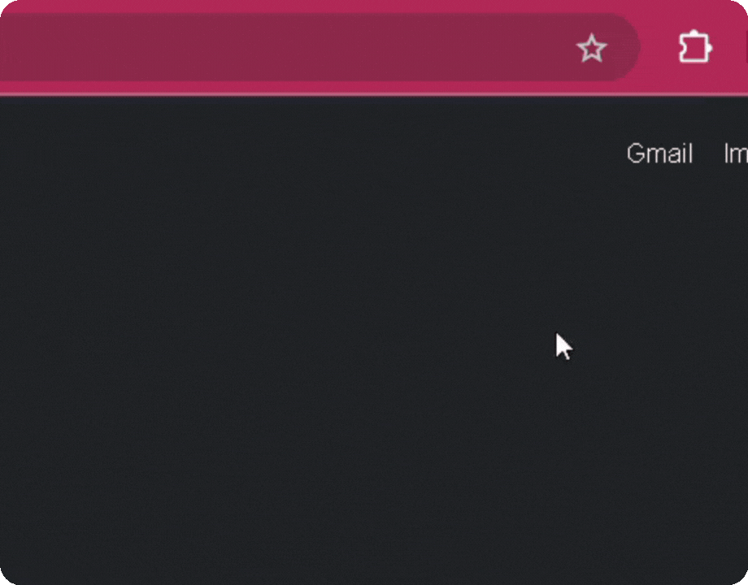
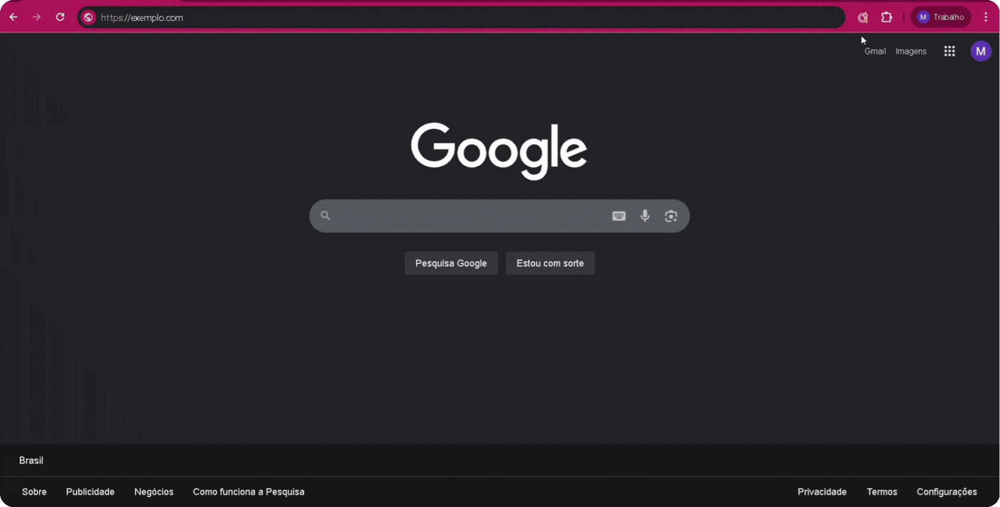
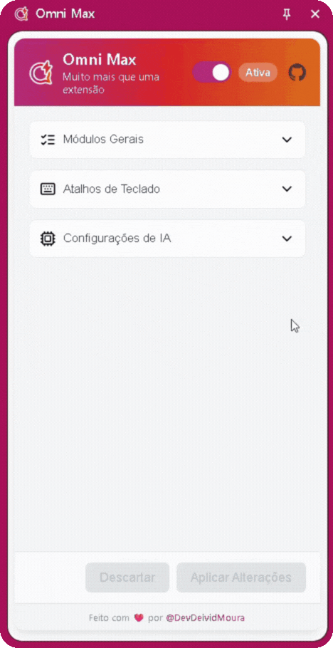
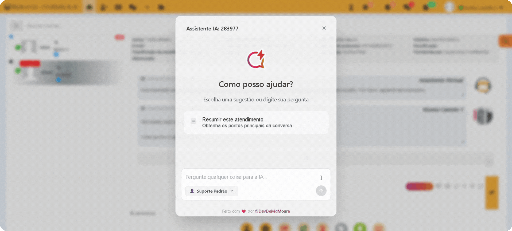

# Omni Max - Guia do Super Agente 🦸

[English](./USER_GUIDE.md) · Português · [Español](./USER_GUIDE.es.md)

---

E aí, agente\! Boas-vindas ao seu centro de treinamento. Este guia é o mapa para dominar todos os superpoderes que a **Omni Max** oferece.

Sua missão, caso decida aceitar, é transformar sua rotina de atendimento, automatizar o tédio e focar no que você faz de melhor: ser incrível com pessoas.

Vamos decolar\! 🚀

## Sumário

1.  [Instalação: Vestindo o Traje](#1-instalação-vestindo-o-traje)
2.  [Primeira Configuração: Ligando os Motores](#2-primeira-configuração-ligando-os-motores)
3.  [Dominando seu Arsenal: Funcionalidades](#3-dominando-seu-arsenal-funcionalidades)
      * [O Assistente de IA: Seu Copiloto Inteligente](#o-assistente-de-ia-seu-copiloto-inteligente)
      * [Turbinando a IA: Personas e Base de Conhecimento](#turbinando-a-ia-personas-e-base-de-conhecimento)
      * [Ferramentas do Dia a Dia: Agilidade Máxima](#ferramentas-do-dia-a-dia-agilidade-máxima)
4.  [Solução de Problemas: Pequenos Ajustes na Rota](#4-solução-de-problemas-pequenos-ajustes-na-rota)

-----

### 1\. Instalação: Vestindo o Traje

Para começar sua jornada, primeiro você precisa adquirir seu traje. A Omni Max está disponível nas principais lojas de extensões.

1.  Acesse a loja do seu navegador:
      * [**Google Chrome**](#)
      <!-- * [**Microsoft Edge**](#)
      * [**Mozilla Firefox**](#) -->
2.  Clique em **"Adicionar ao Navegador"** ou **"Obter"**.
3.  Confirme a instalação. O ícone da Omni Max () aparecerá na sua barra de ferramentas. 

**Dica de Pro**: Se ele estiver escondido dentro do menu de extensões (o ícone de quebra-cabeça 🧩), clique ali, encontre a Omni Max () na lista e clique no alfinete (📌) para fixá-la na barra. Assim, ela estará sempre a um clique de distância!

### 2\. Primeira Configuração: Ligando os Motores

Com o traje vestido, é hora de sincronizar-se com sua base de operações. Esta configuração inicial é crucial e leva menos de 30 segundos.

#### **Passo 1: Conecte a Omni Max à sua Plataforma**

1.  Navegue até a página do Painel do Agente da sua plataforma de atendimento (ASC SAC e variações White-label).
2.  Clique no ícone da **Omni Max ()** na barra de ferramentas do navegador. Um pequeno popup vai surgir.
3.  A extensão tentará adivinhar a URL, mas confirme se o domínio está correto. Se precisar, copie a URL do seu navegador e cole no campo.
4.  Clique em **"Salvar"**. A página será recarregada automaticamente.

#### **Passo 2: Explore seu Painel de Controle**

Após salvar a URL, um painel lateral se tornará disponível. Clique no ícone da **Omni Max** no canto do seu navegador para abrir seu novo painel de controle sempre que precisar. É aqui que toda a mágica acontece\!

Por padrão, os módulos **"Atalhos de Teclado"** e **"Processador de Templates"** já vêm ativados para turbinar sua produtividade desde o início.

#### **Passo 3: Dê Vida à sua IA (Opcional, mas incrível\!)**

As funcionalidades de Inteligência Artificial vêm desativadas. Para ligar seu copiloto, siga estes passos no painel de controle:

1.  Vá para a seção **"Configurações de IA"** e ative o interruptor mestre **"Habilitar Todas as Funções de IA"**.
2.  **Escolha seu Provedor de IA:** Selecione entre **OpenAI**, **Gemini** (Google) ou **Ollama** (para quem roda modelos localmente).
3.  **Adicione suas Credenciais 🔑:**
      * Clique em **"Gerenciar Credenciais"**.
      * Para OpenAI ou Gemini, cole sua **Chave de API (API Key)**.
      * Para Ollama, insira a **URL Base** do seu servidor (ex: `http://localhost:11434`).
      * Clique em **"Salvar"**.
4.  **Selecione os Modelos:** Após validar as credenciais, a Omni Max carregará os modelos disponíveis.
      * Escolha um **"Modelo de Chat"** (para conversas, ex: `gpt-4.1`, `gemini-2.5-pro`).
      * Escolha um **"Modelo de Embedding"** (para a IA ler documentos, ex: `text-embedding-3-small`).
5.  **Ative o Assistente:** O módulo **"IA: Assistente de Chat"** é ativado por padrão assim que a IA geral é ligada.
6.  Role até o fim e clique em **"Aplicar Alterações"**.

Pronto\! O botão  agora aparecerá na área de digitação da sua plataforma, pronto para a ação.

### 3\. Dominando seu Arsenal: Funcionalidades

#### O Assistente de IA: Seu Copiloto Inteligente

Diferente de IAs genéricas, o seu assistente é um especialista. Ele já chega na conversa sabendo de tudo, pois lê o histórico do atendimento para entender o contexto.

  * **Como usar:**
    1.  Durante um atendimento, clique no botão .
    2.  Na janela que abrir, faça uma pergunta ("Resuma o problema do cliente") ou clique em uma sugestão.
    3.  A resposta aparecerá em segundos. Você pode copiá-la ou pedir para ele refinar.

#### Turbinando a IA: Personas e Base de Conhecimento

**🎭 Personas: Dê uma Personalidade à sua IA**
Cansado de respostas robóticas? Crie "Personas" para ensinar a IA a se comportar de maneiras diferentes.

  * **Como criar:**
    1.  No painel, vá para **"Gerenciamento de Personas"** e clique em **"Adicionar Nova"**.
    2.  Dê um nome (ex: "Especialista em Faturas").
    3.  No campo "Prompt do Sistema", dê as instruções: "Você é um especialista financeiro. Seja formal, direto e responda apenas sobre cobranças e pagamentos."
    4.  Salve. Agora você pode selecionar essa persona dentro da janela do assistente para mudar o tom da IA instantaneamente.

**🧠 Base de Conhecimento: Construa sua Biblioteca Secreta**
Faça a IA responder com base nos *seus* documentos\! Adicione manuais, procedimentos e políticas internas.

  * **Como adicionar documentos:**
    1.  No painel, vá para **"Base de Conhecimento (RAG)"**.
    2.  Clique em **"Adicionar Novo Documento"** e escolha um arquivo `.txt` ou `.md`.
    3.  Se quiser, altere o nome da fonte (útil para referência).
    4.  Salve.

Pronto\! O assistente agora irá consultar sua biblioteca antes de responder, garantindo informações precisas e alinhadas à sua empresa.

#### Ferramentas do Dia a Dia: Agilidade Máxima

**⌨️ Atalhos de Cópia Rápida**
Copie informações do cliente (nome, CPF/CNPJ) com um simples comando.

  * **Como usar:** Use as combinações de teclas padrão ou...
  * **Como personalizar:** Vá para **"Atalhos de Teclado"** no painel, clique na combinação atual e digite sua nova combinação preferida. Simples assim\!

**📝 Processador de Templates Mágicos**
Esta funcionalidade turbina as **"Respostas Rápidas"** nativas da plataforma. Crie seus templates com variáveis especiais e deixe a Omni Max fazer o trabalho pesado, preenchendo informações e pulando entre campos para você.

##### **Como funciona o fluxo mágico:**

1.  **Ative o Template:** No campo de mensagem, comece a digitar o atalho da sua resposta rápida (por exemplo, `#`) e pressione `Tab` para inseri-la.

2.  **Mágica Automática:** Instantaneamente, a Omni Max entra em ação!
    * Ela substitui variáveis fixas, como `{NOME}`, pelo nome correto do cliente.
    * A primeira variável que você precisa preencher (ex: `[ASSUNTO]`) já virá selecionada.

3.  **Navegue com o `Tab`:** Digite a informação necessária e, em vez de usar o mouse, apenas pressione `Tab`. A Omni Max pulará para a próxima variável editável na sua mensagem.

4.  **Complete e Envie:** Continue preenchendo e pressionando `Tab` até que o template esteja perfeito.

### 4\. Solução de Problemas: Pequenos Ajustes na Rota

Às vezes, até um super-herói precisa de um ajuste no traje.

  * **O painel lateral ou o botão do assistente não aparecem?**

      * Verifique se a **URL da plataforma** está salva corretamente no popup da extensão (Passo 1 da configuração).
      * Certifique-se de que os **interruptores globais** da extensão e das funcionalidades de IA estão ligados no painel.
      * Dê um bom e velho F5 na página para recarregar.

  * **Os modelos de IA não carregam na lista?**

      * A causa nº 1 é uma **credencial inválida**. Verifique se sua Chave de API ou URL do Ollama estão corretas.
      * Se estiver usando **Ollama**, garanta que o programa está rodando no seu computador.
      * Verifique sua conexão com a internet. A Omni Max precisa dela para falar com o provedor de IA.

  * **Um atalho de teclado não funciona?**

      * Verifique se o módulo de atalhos está ativo no painel.
      * Outra extensão ou programa pode estar usando a mesma combinação. Tente personalizar o atalho para uma combinação diferente.

Se a aventura ficar complicada, não hesite em nos chamar\! [**Abra uma issue em nosso GitHub**](https://github.com/DevDeividMoura/omni-max/issues) e a comunidade virá ao resgate.

