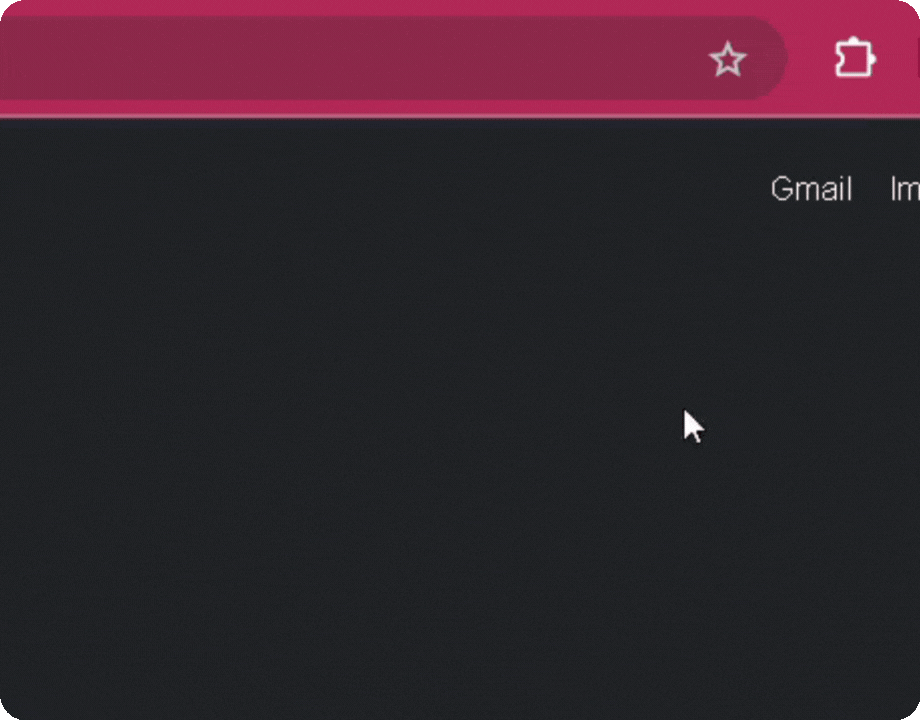

# Omni Max - Super Agent's Guide 🦸

English · [Português](./USER_GUIDE.pt-BR.md) · [Español](./USER_GUIDE.es.md)

---

Hey, agent! Welcome to your training center. This guide is the map to mastering all the superpowers **Omni Max** has to offer.

Your mission, should you choose to accept it, is to transform your customer service routine, automate the tedious stuff, and focus on what you do best: being awesome with people.

Let's blast off! 🚀

## Table of Contents

1.  [Installation: Suiting Up](#1-installation-suiting-up)
2.  [First-Time Setup: Firing Up the Engines](#2-first-time-setup-firing-up-the-engines)
3.  [Mastering Your Arsenal: Features](#3-mastering-your-arsenal-features)
    * [The AI Assistant: Your Smart Copilot](#the-ai-assistant-your-smart-copilot)
    * [Powering Up the AI: Personas & Knowledge Base](#powering-up-the-ai-personas--knowledge-base)
    * [Day-to-Day Tools: Maximum Agility](#day-to-day-tools-maximum-agility)
4.  [Troubleshooting: Minor Course Corrections](#4-troubleshooting-minor-course-corrections)

-----

### 1. Installation: Suiting Up

To begin your journey, you first need to get your suit. Omni Max is available in the main extension stores.

1.  Go to your browser's store:
    * [**Google Chrome**](#)
    2.  Click **"Add to Browser"** or **"Get"**.
3.  Confirm the installation. The Omni Max icon () will appear in your toolbar.

**Pro-Tip**: If it's hidden inside the extensions menu (the 🧩 puzzle piece icon), click on it, find Omni Max () in the list, and click the pin (📌) to fix it to your toolbar. This way, it will always be just one click away!

### 2. First-Time Setup: Firing Up the Engines

With the suit on, it's time to sync with your base of operations. This initial setup is crucial and takes less than 30 seconds.

#### **Step 1: Connect Omni Max to Your Platform**

1.  Navigate to the Agent Dashboard page of your customer service platform (ASC SAC and White-label variations).
2.  Click the **Omni Max ()** icon in your browser's toolbar. A small popup will appear.
3.  The extension will try to guess the URL, but confirm the domain is correct. If needed, copy the URL from your browser and paste it into the field.
4.  Click **"Save"**. The page will reload automatically.

#### **Step 2: Explore Your Control Panel**

After saving the URL, a side panel will become available. Click the **Omni Max** icon in your browser's corner to open your new control panel whenever you need it. This is where all the magic happens!

By default, the **"Keyboard Shortcuts"** and **"Template Processor"** modules are already enabled to boost your productivity from the start.

#### **Step 3: Bring Your AI to Life (Optional, but awesome!)**

The Artificial Intelligence features come disabled. To turn on your copilot, follow these steps in the control panel:

1.  Go to the **"AI Settings"** section and enable the **"Enable All AI Features"** master switch.
2.  **Choose Your AI Provider:** Select from **OpenAI**, **Gemini** (Google), or **Ollama** (for those who run models locally).
3.  **Add Your Credentials 🔑:**
    * Click **"Manage Credentials"**.
    * For OpenAI or Gemini, paste your **API Key**.
    * For Ollama, enter the **Base URL** of your server (e.g., `http://localhost:11434`).
    * Click **"Save"**.
4.  **Select the Models:** After validating the credentials, Omni Max will load the available models.
    * Choose a **"Chat Model"** (for conversations, e.g., `gpt-4.1`, `gemini-2.5-pro`).
    * Choose an **"Embedding Model"** (for the AI to read documents, e.g., `text-embedding-3-small`).
5.  **Activate the Assistant:** The **"AI: Chat Assistant"** module is enabled by default as soon as the main AI is turned on.
6.  Scroll to the bottom and click **"Apply Changes"**.

All set! The  button will now appear in your platform's input area, ready for action.

### 3. Mastering Your Arsenal: Features

#### The AI Assistant: Your Smart Copilot

Unlike generic AIs, your assistant is an expert. It joins the conversation already knowing everything, as it reads the entire interaction history to understand the context.

* **How to use:**
    1.  During a customer interaction, click the  button.
    2.  In the window that opens, ask a question ("Summarize the customer's issue") or click a suggestion.
    3.  The answer will appear in seconds. You can copy it or ask the AI to refine it.

#### Powering Up the AI: Personas & Knowledge Base

**🎭 Personas: Give Your AI a Personality**
Tired of robotic answers? Create "Personas" to teach the AI to behave in different ways.

* **How to create:**
    1.  In the panel, go to **"Persona Management"** and click **"Add New"**.
    2.  Give it a name (e.g., "Billing Specialist").
    3.  In the "System Prompt" field, provide instructions: "You are a financial specialist. Be formal, direct, and only answer questions about billing and payments."
    4.  Save. Now you can select this persona within the assistant window to instantly change the AI's tone.

**🧠 Knowledge Base: Build Your Secret Library**
Make the AI answer based on *your* documents! Add manuals, procedures, and internal policies.

* **How to add documents:**
    1.  In the panel, go to **"Knowledge Base (RAG)"**.
    2.  Click **"Add New Document"** and choose a `.txt` or `.md` file.
    3.  If you want, change the source name (useful for reference).
    4.  Save.

Done! The assistant will now consult your library before answering, ensuring accurate and company-aligned information.

#### Day-to-Day Tools: Maximum Agility

**⌨️ Quick Copy Shortcuts**
Copy customer information (name, ID number) with a simple command.

* **How to use:** Use the default key combinations or...
* **How to customize:** Go to **"Keyboard Shortcuts"** in the panel, click on the current combination, and type your new preferred one. It's that simple!

**📝 Magic Template Processor**
This feature supercharges the platform's native **"Quick Replies"**. Create your templates with special variables and let Omni Max do the heavy lifting, filling in information and jumping between fields for you.

##### **How the magic workflow works:**

1.  **Activate the Template:** In the message field, start typing the shortcut for your quick reply (e.g., `#`) and press `Tab` to insert it.

2.  **Automatic Magic:** Instantly, Omni Max springs into action!
    * It replaces fixed variables, like `{NAME}`, with the correct customer's name.
    * The first variable you need to fill in (e.g., `[SUBJECT]`) will already be selected.

3.  **Navigate with `Tab`:** Type the necessary information and, instead of using the mouse, just press `Tab`. Omni Max will jump to the next editable variable in your message.

4.  **Complete and Send:** Keep filling and tabbing until the template is perfect.

### 4. Troubleshooting: Minor Course Corrections

Sometimes, even a superhero needs a suit adjustment.

* **The side panel or assistant button doesn't appear?**
    * Check if the **platform URL** is saved correctly in the extension's popup (Step 1 of the setup).
    * Make sure the **global switches** for the extension and AI features are turned on in the panel.
    * Try reloading the page.

* **The AI models don't load in the list?**
    * The #1 cause is an **invalid credential**. Double-check your API Key or Ollama URL.
    * If you're using **Ollama**, ensure the program is running on your computer.
    * Check your internet connection. Omni Max needs it to talk to the AI provider.

* **A keyboard shortcut isn't working?**
    * Check if the shortcuts module is active in the panel.
    * Another extension or program might be using the same combination. Try customizing the shortcut to a different key combination.

If the adventure gets complicated, don't hesitate to reach out! [**Open an issue on our GitHub**](https://github.com/DevDeividMoura/omni-max/issues) and the community will come to the rescue.